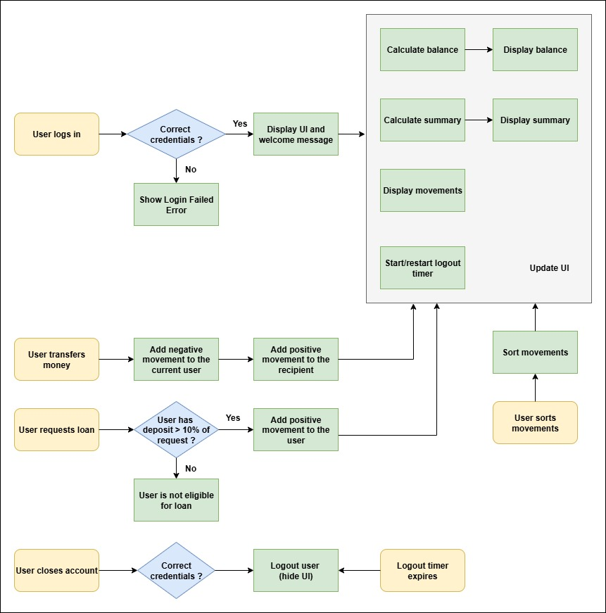

# bankist

bankist is a simple bank ui.

### Architecture:

### Features:

1. Supports bare-metal conditional rendering similar to React.
2. Supports login/logout.
3. Supports money transfer.
4. Supports loan facility.
5. Supports account closure.
